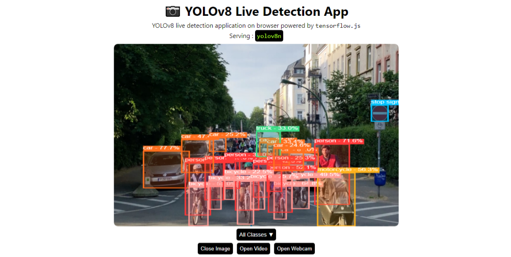

# Object Detection React App

  

---

Object Detection application right in your browser. Serving YOLOv8 in browser using tensorflow.js
with `webgl` backend.

### Features

1. Detection in Image
2. Detection in Video
3. Detection with webCam
4. Filter Classes
